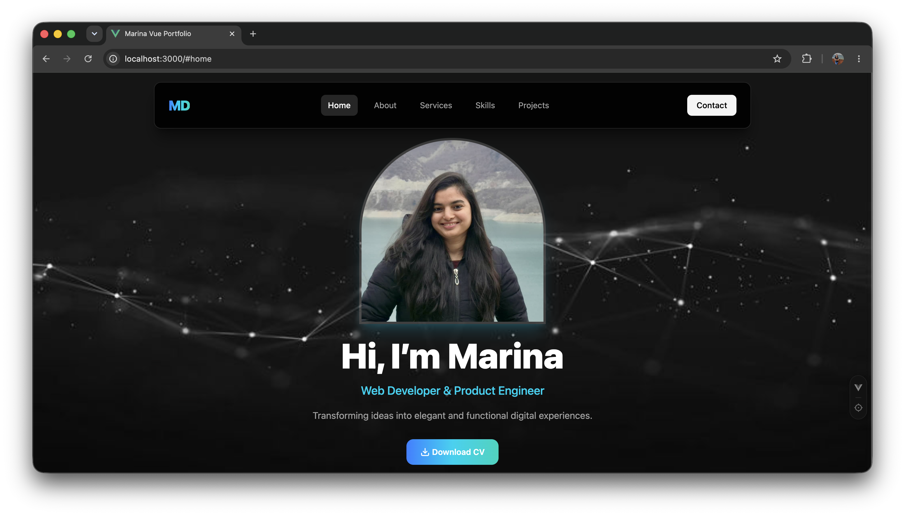
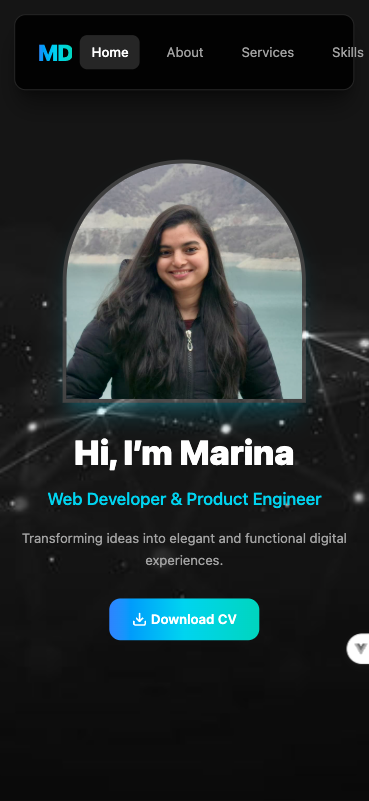

# Marina Dantis — Web Developer & Product Engineer Portfolio 🚀

A modern, high-performance developer portfolio website built using **Vue.js**, **TypeScript**, and **Tailwind CSS v4**. This repository contains the source code for showcasing my personal engineering projects, technical skill sets, and professional experience.

🔗 **Live Demo:** [marina-dantis-vue-portfolio.vercel.app](https://marina-dantis-vue-portfolio.vercel.app/)

---


## 📸 Screenshots & Preview

### Desktop View


### Mobile View


---

## 🛠️ Tech Stack & Tooling

* **Vue 3**: Component-driven frontend framework leveraging the Composition API (`<script setup>`).
* **TypeScript**: Enforces strict type safety and cleaner object refactoring across the codebase.
* **Tailwind CSS v4**: Utility-first CSS compiling via native Vite compilation layers for extreme speed.
* **Vite**: Ultra-fast frontend toolchain facilitating hot module replacement (HMR) and optimized distribution builds.

---

## ✨ Features & Best Practices

* **Fluid Micro-Interactions**: Custom call-to-action buttons styled with tactile states (`hover:scale-105 active:scale-95`) backed by accelerated transform matrices for fluid responsiveness.
* **Tailwind v4 `@theme` Architecture**: Background vector graphics and layouts configured safely through local CSS variables rather than legacy configuration scripts.
* **Responsive Breakpoint Scaling**: Tailored sizing matrices running seamlessly from mobile views up through MacBook screen sizes (`lg:`) and desktop monitors (`2xl:`).
* **Accessible Typography Scales**: Built using custom layout layer safety anchors (`relative` tracking) and enhanced spacing metrics (`leading-relaxed`) to fulfill high contrast readability guidelines.

---

## 📂 Project Directory Structure

```text
├── public/               # Static system root assets
│   └── assets/           # Directly accessible, uncompiled documents & PDFs
│       └── pdfs/         # Resumes and professional documentation
├── src/                  # Application runtime environment
│   ├── assets/           # Local style sheets and optimized graphical files
│   │   ├── images/       # High-definition imagery (avatars, custom heroes)
│   │   └── main.css      # Core entry styles with Tailwind v4 @theme directives
│   ├── components/       # Reusable layout fragments (HeroSection, Navbar)
│   ├── App.vue           # Root structural application component
│   └── main.ts           # Production application launch engine
├── package.json          # Node dependency profiles and automated build scripts
└── vite.config.ts        # Bundler configuration file defining path aliases
```

---

## 🚀 Getting Started

Follow these instructions to set up a clone of this repository and run the development pipeline locally on your machine.

### Prerequisites

Ensure you have **Node.js** installed (version 18.x or higher is highly recommended).
* Verify installation: `node -v`

### Installation Steps

1. **Clone the repository:**
   ```bash
   git clone https://github.com/your-github-username/vue-portfolio.git
   ```

2. **Navigate directly into the project directory:**
   ```bash
   cd vue-portfolio
   ```

3. **Install all compilation and package dependencies:**
   ```bash
   npm install
   ```

### Local Development Pipeline

Spin up the local hot-reload compilation server:
```bash
npm run dev
```
Once initialized, open your browser and navigate to the address displayed in your terminal (typically `http://localhost:3000/`).

### Production Optimization Build

Compile, optimize, and bundle the application source files into minified production assets ready for deployment:
```bash
npm run build
```
The final distribution assets will automatically be compiled into the root `/dist` directory.

---

## 📦 Deployment Configuration

This repository is optimized for one-click global deployments on **Vercel**. 
The configuration natively maps to Vite's output settings. When deploying manually or linking a continuous integration environment, ensure your project build settings use:
* **Build Command:** `npm run build`
* **Output Directory:** `dist`

---

## 👩‍💻 Author

Marina Dantis

Frontend Developer | QA Engineer

Portfolio: https://marina-dantis-vue-portfolio.vercel.app